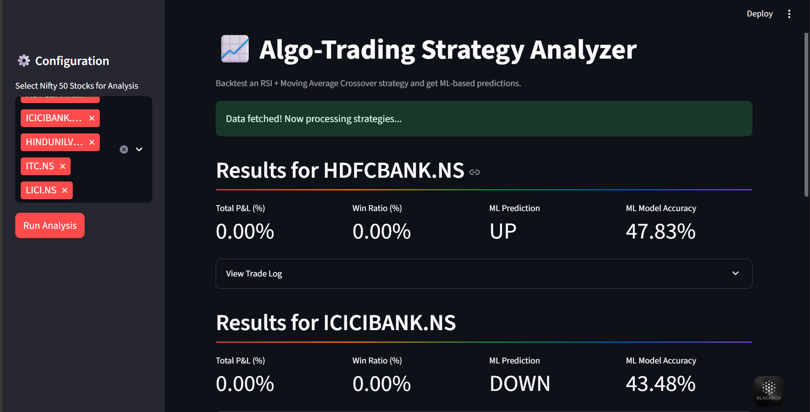

# Algo-Trading System with ML & Google Sheets Automation
A Python-based prototype for an algorithmic trading system that backtests a trading strategy, uses an ML model for prediction, logs results automatically to Google Sheets, and provides an interactive web interface.

## Features
* Interactive Web Interface: Built with Streamlit to select stocks and visualize results in real-time.

* Data Ingestion: Fetches daily stock data for NIFTY 50 stocks using the yfinance library.

* Trading Strategy: Implements and backtests a strategy based on RSI + Moving Average Crossover.

* Advanced Machine Learning: Uses a Random Forest model to predict the next day's price movement.

* Automated Reporting: Automatically logs detailed trade data and performance summaries (P&L, Win Ratio) to Google Sheets.

## Tech Stack & Libraries

* Pandas: For data manipulation and analysis.

* yfinance: To download historical market data from Yahoo Finance.

* pandas-ta: For calculating technical analysis indicators like RSI and Moving Averages.

* scikit-learn: For building and evaluating the machine learning model.

* gspread: To interact with the Google Sheets API.

* schedule: For scheduling the script to run automatically.

## Configuration 
You must configure two things before running the script:

1. Google Sheets API Credentials
The script needs a Google Service Account to write to Google Sheets.

Go to the Google Cloud Console, create a new project.

Enable the Google Drive API and Google Sheets API.

Create a Service Account, generate a new JSON key, and download it.

Rename the downloaded file to creds.json and place it inside the config/ directory.

Open the creds.json file, find the client_email address, and copy it.

Create a new Google Sheet and Share it with that email address, giving it Editor access.

2. Project Settings
Open config/settings.py to customize the algorithm:

NIFTY_50_STOCKS: This list populates the selection box in the Streamlit app.

GOOGLE_SHEET_NAME: Ensure this matches the name of your Google Sheet.

You can also adjust the parameters for your trading strategy (e.g., RSI_PERIOD).

## Frontend Interface
The Streamlit app provides an easy-to-use interface to interact with the trading algorithm.

Select Stocks: Choose one or more stocks from the sidebar.

Run Analysis: Click the button to trigger the backtest and ML prediction.

View Results: Key metrics like P&L, Win Ratio, and ML predictions are displayed instantly.

Detailed Logs: Expandable sections show the full trade log for each stock.

Auto-Logging: All results generated via the frontend are automatically saved to your Google Sheet.

## Screenshot

## How to Run

You can run the project in two ways:

1. Run the Interactive Web App (Recommended)
This is the best way to interact with the project.
Code- "streamlit run app.py"

2. Run the Automated Script
This runs the original script for the tickers defined in config/settings.py without a user interface. It can be scheduled for automated execution.

Code- "python main.py"